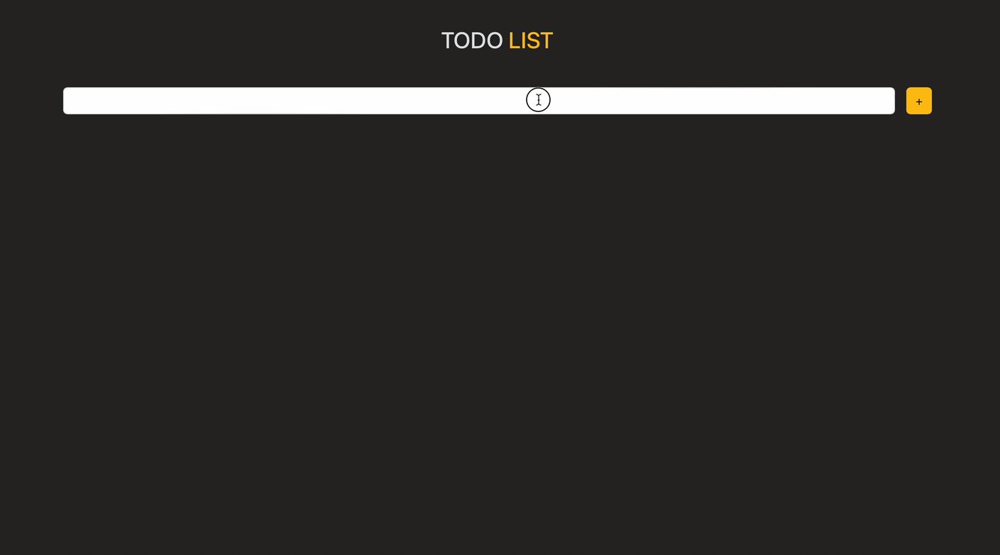

<h1>Redux Crud Project</h1>

This project is a "To-Do List" application built with React and Redux. It allows users to manage their tasks by adding, updating, and deleting them while utilizing Redux for state management.

<h2>Features</h2>

<list>

- Add New Task: Add new tasks via a simple form.

- Update Task: Edit tasks using a modal component for easy modifications.

- Delete Task: Remove tasks with a confirmation prompt to prevent accidental deletions.

- Toggle Task Status: Mark tasks as completed or incomplete with a single click.

- Redux State Management: Use Redux for consistent state management, handling task additions, updates, and deletions.

- Notifications: Provides user feedback using react-toastify for alerts and messages.

- Styling with Bootstrap: Utilizes Bootstrap for a clean and responsive design.

</list>

<h2>Preview:</h2>

